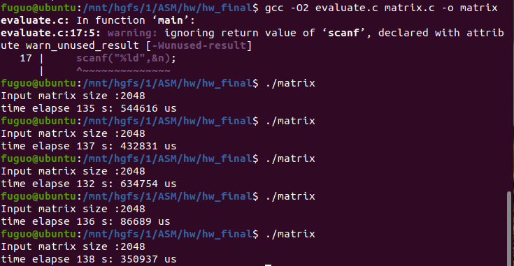
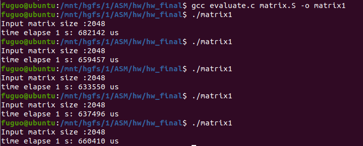
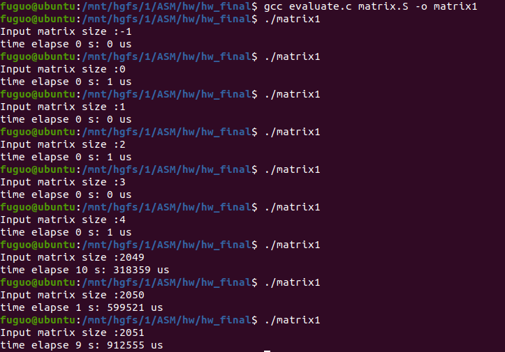

# 汇编语言大作业报告

付国 2019K8009922008

## 1. 代码展示

为了便于理解，先展示汇编文件的C语言伪代码(不完全符合C语言语法)。有些优化的细节不能在伪代码中体现，需要查看源码。`matrix`函数主要分为转置部分、核心乘法部分、剩余乘法部分。转置部分将矩阵`b`的转置存到矩阵`b2`中，在之后就不需要访问`b`，`b[i][j]`的值可以通过`b2[j][i]`的值得到。剩余乘法部分主要应对应对奇数矩阵规模的情况，或者模4余2的矩阵规模的最后两行的情况。

```c
// file name: matrix2.c
// C pseudocode of matrix.S
void matrix(double *a, double *b, double *c, long n){
    long i, j, k;
    if (n <= 0) return;

    // 矩阵转置，从b到b2
    double *b2 = (double*)malloc(8*n*n);
    double *b2in0 = b2;         // b2[i][0]
    double *b2in1 = &b2in0[n];  // b2[i+1][0]
    double *b2in2 = &b2in1[n];  // b2[i+2][0]
    double *b2in3 = &b2in2[n];  // b2[i+3][0]
    for (i = 0; i < n; i += 4){
        double *bjni = &b[j*n]; // b[j][0] 
        for (j = 0; j < n; j++){
            b2in0[j] = bjni[0]; // b2[i][j] = b[j][i];
            b2in1[j] = bjni[1]; // b2[i+1][j] = b[j][i+1];
            b2in2[j] = bjni[2]; // b2[i+2][j] = b[j][i+2];
            b2in3[j] = bjni[3]; // b2[i+3][j] = b[j][i+3];
            bjni = &bjni[n];
        }
        b2in0 = &b2in0[4*n];
        b2in1 = &b2in1[4*n];
        b2in2 = &b2in2[4*n];
        b2in3 = &b2in3[4*n];
    }

    if (n/2) goto REST;
    // 矩阵乘法的核心部分
    for (i = 0; i + 4 <= n; i += 4){
        for (j = 0; j < n; j++){
            xmm0 = xmm1 = xmm2 = xmm3 = 0;
            double *ain0 = &a[i*n];
            double *ain1 = &ain0[n];  
            double *ain2 = &ain1[n];
            double *ain3 = &ain2[n];
            double *b2jn = &b2[j*n];
            for (k = 0; k < n; k += 2){
                xmm4 = (ain0[k]:ain0[k+1]); // a[i][k]:a[i][k+1]
                xmm5 = (ain1[k]:ain1[k+1]); // a[i+1][k]:a[i+1][k+1]
                xmm6 = (ain2[k]:ain2[k+1]); // a[i+2][k]:a[i+2][k+1]
                xmm7 = (ain3[k]:ain3[k+1]); // a[i+3][k]:a[i+3][k+1]
                xmm8 = (b2jn[k]:b2jn[k+1]); // b[k][j]:b[k+1][j]

                xmm4 *= xmm8;
                xmm5 *= xmm8;
                xmm6 *= xmm8;
                xmm7 *= xmm8;

                xmm0 += xmm4;
                xmm1 += xmm5;
                xmm2 += xmm6;
                xmm3 += xmm7;
            }
            double *cin0j = &c[i*n+j]; // c[i][j]
            double *cin1j = &cin0j[n]; // c[i+1][j]
            double *cin2j = &cin1j[n]; // c[i+2][j]
            double *cin3j = &cin2j[n]; // c[i+3][j]
            cin0j[0] = xmm0.high + xmm0.low;
            cin1j[0] = xmm1.high + xmm1.low;
            cin2j[0] = xmm2.high + xmm2.low;
            cin3j[0] = xmm3.high + xmm3.low;
        }
    }

REST: 
    // 矩阵乘法的剩余部分，应对奇数矩阵规模的情况，
    // 或者模4余2的矩阵规模的最后两行的情况
    for (; i < n; i++){
        for (j = 0; j < n; j++){
            xmm2.low = 0;
            double *ain = &a[i*n];   // a[i][0]
            double *b2jn = &b2[j*n]; // b[0][j]
            for (k = 0; k < n; k++){
                xmm0.low = b2jn[k]; // b[k][j]
                xmm1.low = ain[k];  // a[i][k]
                xmm2.low += xmm0.low * xmm1.low;
            }
            c[i*n+j] = xmm2.low;
        }
        
    }

    free(b2);
}
```

下面是汇编代码。右侧提供了完整的更易读的中间代码。为了充分提高速度，需要尽可能利用寄存器。汇编代码中的开始和结束部分就是把需要调用者保存的寄存器压栈和弹栈的过程。另外，例如`a`, `b`, `c`这样的需要转寄存器的变量另存一份到了栈`rsp`中，起到暂存作用。

```assembly
# file name: matrix.S
.text
    .type matrix, @function
    .globl matrix
matrix:
    testq   %rcx, %rcx      # if n <= 0 then exit
    jle     EXIT

    pushq   %rbx            # push callee-saved registers
    pushq   %rbp
    pushq   %r12
    pushq   %r13
    pushq   %r14
    pushq   %r15
    subq    $512, %rsp

    # prepare works #
    xorq    %r15, %r15
    movq    %r15, 32(%rsp)          # rsp[32] = 0
    movq    %r15, 40(%rsp)          # rsp[40] = 0
    leaq    (,%rcx, 8), %r15        # 8*n

    # call malloc #
    movq    %rdi, 0(%rsp)           # a
    movq    %rsi, 8(%rsp)           # b
    movq    %rdx, 16(%rsp)          # c
    movq    %rcx, 24(%rsp)          # n

    movq    %rcx, %rdi              # tmp = t8n
    imulq   %r15, %rdi              # tmp *= n
    call    malloc@PLT              # b2 = malloc(tmp)

    # retrans matrix b into b2 #
    movq    8(%rsp), %rbx           # rbx = b
    movq    24(%rsp), %rdx          # rdx = n
    leaq    (, %r15, 4), %rcx       # t32n = t8n * 4
    movq    %rax, %r8               # b2in0 = b2
    leaq    (%r8, %r15), %r9        # b2in1 = b2in0 + t8n
    leaq    (%r9, %r15), %r10       # b2in2 = b2in1 + t8n
    leaq    (%r10, %r15), %r11      # b2in3 = b2in2 + t8n
    xorq    %rsi, %rsi              # i = 0
L1:    
    leaq    (%rbx, %rsi, 8), %r12   # bjni = b + i * 8
    xorq    %r13, %r13              # t8j = 0
    xorq    %rdi, %rdi              # j = 0
L2:
    movq    (%r12), %rbp            # tmp = (bjni)
    movq    %rbp, (%r8, %r13)       # (b2in0, t8j) = tmp
    movq    8(%r12), %rbp           # tmp = 8(bjni)
    movq    %rbp, (%r9, %r13)       # (b2in1, t8j) = tmp
    movq    16(%r12), %rbp          # tmp = 16(bjni)
    movq    %rbp, (%r10, %r13)      # (b2in2, t8j) = tmp
    movq    24(%r12), %rbp          # tmp = 24(bjni)
    movq    %rbp, (%r11, %r13)      # (b2in3, t8j) = tmp

    addq    %r15, %r12              # bjni += t8n
    addq    $8, %r13                # t8j += 8
    incq    %rdi                    # j++
    cmpq    %rdx, %rdi
    jl      L2                      # if j < n goto L2
    
    addq    %rcx, %r8               # b2in0 += t32n
    addq    %rcx, %r9               # b2in1 += t32n
    addq    %rcx, %r10              # b2in2 += t32n
    addq    %rcx, %r11              # b2in3 += t32n
    addq    $4, %rsi                # i += 4
    cmpq    %rdx, %rsi
    jl      L1                      # if i < n goto L1
    movq    %rax, 48(%rsp)          # b2


    # multiply matrixs #
    xorq    %rsi, %rsi              # i = 0
    movq    $4, %r13
    cmpq    %r13, %rdx
    jl      L10                     # if n < 4 goto L10

    movq    %rdx, %rax
    xorq    %rdx, %rdx
    movq    $2, %r13
    idiv    %r13
    testq   %rdx, %rdx
    jne     L10                     # if n / 2 != 0 goto L6

    movq    0(%rsp), %rax           # a
    movq    48(%rsp), %rbx          # b2
    movq    16(%rsp), %rcx          # c
    movq    24(%rsp), %rdx          # n
    xorq    %rsi, %rsi              # i = 0
L3:
    xorq    %rdi, %rdi              # j = 0
L4:
    xorpd   %xmm0, %xmm0            # xmm0 = 0
    xorpd   %xmm1, %xmm1            # xmm1 = 0
    xorpd   %xmm2, %xmm2            # xmm2 = 0
    xorpd   %xmm3, %xmm3            # xmm3 = 0

    movq    %r15, %r8               # ain0 = t8n
    imulq   %rsi, %r8               # ain0 *= i
    addq    %rax, %r8               # ain0 += a
    leaq    (%r8, %r15), %r9        # ain1 = ain0 + 8*n
    leaq    (%r9, %r15), %r10       # ain2 = ain1 + 8*n
    leaq    (%r10, %r15), %r11      # ain3 = ain2 + 8*n

    movq    %r15, %r12              # b2jn = t8n
    imulq   %rdi, %r12              # b2jn *= j
    addq    %rbx, %r12              # b2jn += b2

    xorq    %r13, %r13              # t8k = 0
    xorq    %rbp, %rbp              # k = 0
L5:
    movapd  (%r8, %r13), %xmm4      # xmm4 = (ain0, t8k)
    movapd  (%r9, %r13), %xmm5      # xmm5 = (ain1, t8k)
    movapd  (%r10, %r13), %xmm6     # xmm6 = (ain2, t8k)
    movapd  (%r11, %r13), %xmm7     # xmm7 = (ain3, t8k)

    movapd  (%r12, %r13), %xmm8     # xmm8 = (b2jn, t8k)

    mulpd   %xmm8, %xmm4            # xmm4 *= xmm8
    mulpd   %xmm8, %xmm5            # xmm5 *= xmm8
    mulpd   %xmm8, %xmm6            # xmm6 *= xmm8
    mulpd   %xmm8, %xmm7            # xmm7 *= xmm8

    addpd   %xmm4, %xmm0            # xmm0 += xmm4
    addpd   %xmm5, %xmm1            # xmm1 += xmm5
    addpd   %xmm6, %xmm2            # xmm2 += xmm6
    addpd   %xmm7, %xmm3            # xmm3 += xmm7

    addq    $16, %r13               # t8k += 16
    addq    $2, %rbp                # k += 2
    cmpq    %rdx, %rbp
    jl      L5                      # if k < n goto L5

    leaq    (%rcx, %rdi, 8), %r13   # cj = c + j * 8
    movq    %r15, %r8               # cin0j = t8n
    imulq   %rsi, %r8               # cin0j *= i
    addq    %r13, %r8               # cin0j += cj
    leaq    (%r8, %r15), %r9        # cin1j = cin0j + t8n
    leaq    (%r9, %r15), %r10       # cin2j = cin1j + t8n
    leaq    (%r10, %r15), %r11      # cin3j = cin2j + t8n
    
    movapd      %xmm0, %xmm4
    unpckhpd    %xmm4, %xmm4
    addsd       %xmm4, %xmm0        # xmm0.lo += xmm0.hi
    movapd      %xmm1, %xmm5
    unpckhpd    %xmm5, %xmm5
    addsd       %xmm5, %xmm1        # xmm1.lo += xmm1.hi
    movapd      %xmm2, %xmm6
    unpckhpd    %xmm6, %xmm6
    addsd       %xmm6, %xmm2        # xmm2.lo += xmm2.hi
    movapd      %xmm3, %xmm7
    unpckhpd    %xmm7, %xmm7
    addsd       %xmm7, %xmm3        # xmm3.lo += xmm3.hi

    movsd   %xmm0, (%r8)            # (cin0j) = xmm0.lo
    movsd   %xmm1, (%r9)            # (cin1j) = xmm1.lo
    movsd   %xmm2, (%r10)           # (cin2j) = xmm2.lo
    movsd   %xmm3, (%r11)           # (cin3j) = xmm3.lo

    incq    %rdi                    # j++
    cmpq    %rdx, %rdi
    jl      L4                      # if j < n goto L4

    addq    $4, %rsi                # i += 4
    leaq    4(%rsi), %r13           # tmp = i + 4
    cmpq    %rdx, %r13
    jle     L3                      # if tmp <= n goto L3

L10:
    movq    0(%rsp), %rax           # a
    movq    48(%rsp), %rbx          # b2
    movq    16(%rsp), %rcx          # c
    movq    24(%rsp), %rdx          # n
L6: # the rest part of mul #
    cmpq    %rdx, %rsi
    jge     L7                      # if i >= n goto L7

    xorq    %rdi, %rdi              # j = 0
L8:
    xorpd   %xmm2, %xmm2            # xmm2 = 0
    movq    %r15, %r9               # ain = t8n
    imulq   %rsi, %r9               # ain *= i
    addq    %rax, %r9               # ain += a
    movq    %r15, %r10              # b2jn = t8n
    imulq   %rdi, %r10              # b2jn *= j
    addq    %rbx, %r10              # b2jn += b
    xorq    %r11, %r11              # t8k = 0
    xorq    %rbp, %rbp              # k = 0
L9:
    movsd   (%r10, %r11), %xmm0     # xmm0.lo = (b2jn, t8k)
    movsd   (%r9, %r11), %xmm1      # xmm1.lo = (ain, t8k)
    mulsd   %xmm0, %xmm1            # xmm1.lo *= xmm0.lo
    addsd   %xmm1, %xmm2            # xmm2.lo += xmm1.lo
    addq    $8, %r11                # t8k += 8
    incq    %rbp                    # k++
    cmpq    %rdx, %rbp
    jl      L9                      # if k < n goto L9

    leaq    (%rcx, %rdi, 8), %r12   # cj = c + j * 8
    movq    %r15, %r13              # t8in = t8n
    imulq   %rsi, %r13              # t8in *= i
    movsd   %xmm2, (%r12, %r13)     # (cj, t8in) = xmm2.lo
    
    incq    %rdi                    # j++
    cmpq    %rdx, %rdi
    jl      L8  	                    # if j < n goto L8

    incq    %rsi                    # i++
    jmp     L6                      # goto L6

L7:
    movq    %rbx, %rdi
    call    free@PLT                # free(b2)

    addq    $512, %rsp
    popq    %r15            # pop callee-saved registers
    popq    %r14
    popq    %r13
    popq    %r12
    popq    %rbp
    popq    %rbx
EXIT:
    ret
```

## 2. 优化思路

对运行时间起决定作用的因素有两个：一个是一次最内层循环执行的时间，另一个是最内层循环执行的测试。我们优化的主要目的就是让这两者的乘积最小。至于其他的部分，运行时间也固然重要，但相较于最内层循环而言，多几次访存和乘法指令就显得无关紧要了。为了便于查看，把最内层循环的代码放到下面。

```assembly
L5:
    movapd  (%r8, %r13), %xmm4      # xmm4 = (ain0, t8k)
    movapd  (%r9, %r13), %xmm5      # xmm5 = (ain1, t8k)
    movapd  (%r10, %r13), %xmm6     # xmm6 = (ain2, t8k)
    movapd  (%r11, %r13), %xmm7     # xmm7 = (ain3, t8k)

    movapd  (%r12, %r13), %xmm8     # xmm8 = (b2jn, t8k)

    mulpd   %xmm8, %xmm4            # xmm4 *= xmm8
    mulpd   %xmm8, %xmm5            # xmm5 *= xmm8
    mulpd   %xmm8, %xmm6            # xmm6 *= xmm8
    mulpd   %xmm8, %xmm7            # xmm7 *= xmm8

    addpd   %xmm4, %xmm0            # xmm0 += xmm4
    addpd   %xmm5, %xmm1            # xmm1 += xmm5
    addpd   %xmm6, %xmm2            # xmm2 += xmm6
    addpd   %xmm7, %xmm3            # xmm3 += xmm7

    addq    $16, %r13               # t8k += 16
    addq    $2, %rbp                # k += 2
    cmpq    %rdx, %rbp
    jl      L5                      # if k < n goto L5
```

### 2.1. 矩阵转置

最重要的部分放在最前面说。在进行了矩阵转置的大胆尝试之前，我也尝试过改变循环次序的方法。

但是不论是`ikj`的次序还是`kij`的次序都解决不了两个问题。第一个问题是由于最内层循环不是`k`的循环，乘积的累加采用访存指令，不能把结果暂存到寄存器中。第二个问题是不能自然地利用SSE2中的`movapd`, `mulpd`, `addpd`指令，因为如果要获得可观的优化效果，`mulpd`必须一次算两个乘法，这两个乘法所需的操作数一定两个在`a`里面，两个在`b`里面，如果没有转置的话，我们是不可能通过一次`movapd`把所需的两个`a`里面的操作数放到一个`xmm`寄存器，通过另一次`movpd`把所需的`b`里面的操作数放到另一个`xmm`寄存器，一定需要更多的`movxx`类指令。两次`movapd`是一定不够的，因为两个`a`里的操作数和两个`b`里的操作数必然是一对同行另一对同列，而`movapd`要求两个操作数在内存中紧邻，如果不转置的话，肯定无法满足两个`a`里的操作数紧邻，且两个`b`里的操作数紧邻。

但是通过矩阵转置就可以充分发挥SSE2指令的作用。原本对`b[i][j]`的访问可通过对`b2[j][i]`的访问来代替。依然使用原本的`ijk`循环次序，然后对`k`循环（即最内层循环）进行2展开。为了方便说明，我们这里先不考虑对`i`循环的4展开。举例来说，最内层循环所做的事情可能只有下面这些了：把`a[i][k]`和`a[i][k+1]`通过一个`movapd`放到一个`xmm`寄存器里面，把`b2[j][k]`和`b2[j][k+1]`（实际上也就是`b[k][j]`和`b[k+1][j]`）通过另一个`movapd`移到另一个`xmm`寄存器里，然后通过`mulpd`得到两个`xmm`寄存器的乘积，再把乘积通过`addpd`累加到一个暂存累加值的`xmm`寄存器里面。这就是一次最内层循环所做的事，没有一点冗余的操作。经过实践，在其他优化程度相同的情况下，先转置在相乘比调整循环次序的运行时间减少了约三分之一。

在进行循环展开和强度削弱等优化后，调用`malloc`，调用`free`，矩阵转置的总时间可以控制到0.02秒以内，这相较于矩阵乘法的时长是微不足道的。但却对矩阵乘法的优化效果确实明显的。

### 2.2. 循环展开

循环展开的目的是通过减少循环的次数增加访问的空间局部性。循环的展开无非有三种情况：对`i`循环展开，对`j`循环展开，对`k`循环展开。下面依次粗略分析三种循环展开的效果。

1. 对`i`循环展开：每次`i`循环中都会在Cache中完全刷一遍`b2`矩阵。若对`i`循环进行`r`展开，则共计在Cache中刷过`n/r`次`b2`矩阵。
2. 对`j`循环展开：在整个乘法的过程中，`a`矩阵只会在Cache里面刷一遍。对`j`循环展开不会减少`a`在Cache中刷过的遍数，但是可以降低在Cache中访问`a`矩阵的次数。若对`j`循环进行`r`展开，在Cache中访问`a`矩阵元素的次数约为$n^2/r$。但综合考虑对`j`循环展开不如对`i`循环展开。
3. 对`k`循环展开：除了为了充分利用SSE2指令而对`k`循环2展开之外，由于本来就是最内层的循环，对`k`循环做更大的展开并没有太大收益，唯一可能想到的收益可能就是减少分支指令的次数，但也会导致代码量上升，占用寄存器增多。在实践中，对`k`循环的进一步展开的性能甚至不如只做2展开。

其实，可以同时对3个循环进行展开。但是同时要考虑到`xmm`的数目。我可以想到的另一种可行的优化策略是对`i`循环4展开，对`j`循环2展开，对`k`循环2展开。这样最终的优化效果可能比已有的优化效果还要好。但是由于需要额外的寄存器之间的转移指令，不能确定这样的优化效果更好。而且这样优化会导致代码量上升。因此我最终没有尝试这种展开的策略，而是采用`i`循环4展开，`k`循环2展开的策略。

### 2.3. 强度削弱

在最内层循环中，由于寻址的需要，需要每次计算$8\times k$ 的值，但是乘法指令需要很多个周期才能完成。因此，专门维持了一个通用寄存器来保留$8\times k$ 的值，每次循环的末尾这个值加8。这样就把乘法指令转化成了加法，减少了执行的周期数。

在代码的其他地方也有类似的优化。例如，用一个通用寄存器始终保存$8\times n$ 的值，在转置的时候用一个寄存器保留$8\times j$ 的值，在最内层循环的最后加8。类似的优化还有很多。但是这些都不在矩阵乘法的最内层循环中，对优化效果没有决定性的作用，就不在此细讲了。

### 2.4. 减少循环分支

简单的把for循环转换为汇编语言的方法会导致每个循环有两个分支跳转指令，第一次是条件判断的结果分支跳转，第二次是无条件跳到条件判断的开头。但是把for循环改成do-while循环，再改成汇编语言，这样每个循环里面就只有一次分支跳转了，即条件判断的结果分支跳转。需要的额外的操作仅仅是对`n == 0`的情况的简单的排除。

本实验代码中的矩阵乘法的最内层循环中就只有一条分支跳转指令。

### 2.5. 提高并行度

对比前面给出的最内层循环的代码，其实最内层循环还用另外一种写法，如下面的代码所示。在下面的代码，相邻指令的数据相关性更高，不能很好的利用处理器的流水线设计。在实际测试中，采用下面写法的程序运行时间也略高于前面的写法。

```assembly
L5:
	movapd  (%r12, %r13), %xmm8     # xmm8 = (b2jn, t8k)
	
    movapd  (%r8, %r13), %xmm4      # xmm4 = (ain0, t8k)
    mulpd   %xmm8, %xmm4            # xmm4 *= xmm8
    addpd   %xmm4, %xmm0            # xmm0 += xmm4
    
    movapd  (%r9, %r13), %xmm5      # xmm5 = (ain1, t8k)
    mulpd   %xmm8, %xmm5            # xmm5 *= xmm8
    addpd   %xmm5, %xmm1            # xmm1 += xmm5
    
    movapd  (%r10, %r13), %xmm6     # xmm6 = (ain2, t8k)
    mulpd   %xmm8, %xmm6            # xmm6 *= xmm8
    addpd   %xmm6, %xmm2            # xmm2 += xmm6
    
    movapd  (%r11, %r13), %xmm7     # xmm7 = (ain3, t8k)
    mulpd   %xmm8, %xmm7            # xmm7 *= xmm8
    addpd   %xmm7, %xmm3            # xmm3 += xmm7

    addq    $16, %r13               # t8k += 16
    addq    $2, %rbp                # k += 2
    cmpq    %rdx, %rbp
    jl      L5                      # if k < n goto L5
```


## 3. 性能和正确性测试

1. 使用原c文件进行`-O2`优化编译。矩阵规模为2048时，平均运行时间为136.010秒

   

2. 使用自己编写的`matrix.S`与测试c文件编译。矩阵规模为2048时，平均运行时间为1.655秒。性能是优化前的81.69倍。

   

3. 对其他矩阵规模的正确性检测。在各个矩阵规模都有正确的输出，且性能都有明显的改进。

   

附：测试电脑型号和配置（数据来自CPU-Z）

| 机型           | 性能模式           | 测试系统                 | 处理器                     | 一级指令Cache | 一级数据Cache | 二级Cache     | 三级Cache  | 内存                       |
| -------------- | ------------------ | ------------------------ | -------------------------- | ------------- | ------------- | ------------- | ---------- | -------------------------- |
| Dell 灵越 7572 | 插电模式(中等性能) | VMware / Unbuntu64 20.04 | Intel Core i7-8550 (Gen 8) | 4x32KB, 8way  | 4x32KB, 8way  | 4x256KB, 4way | 8MB, 16way | 8GB(虚拟机) / 16GB(宿主机) |

